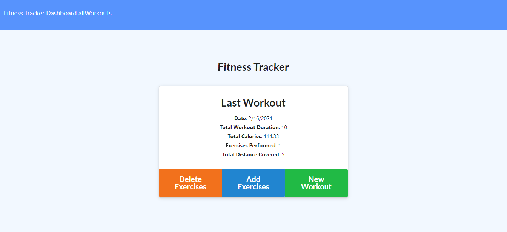
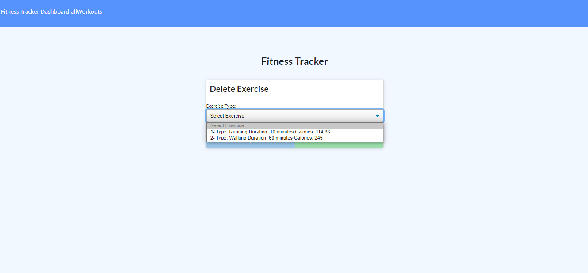
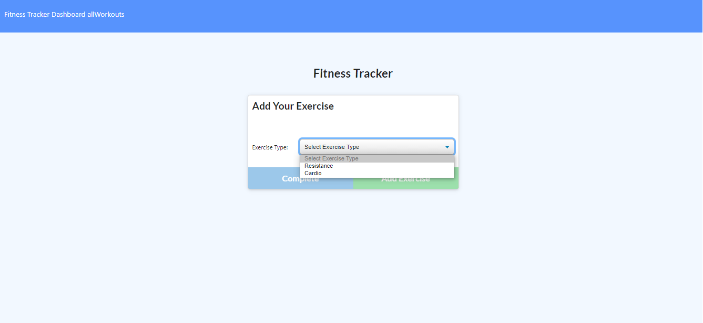
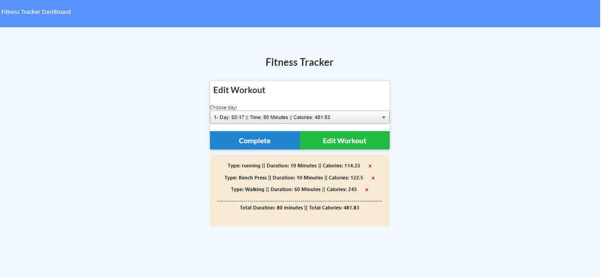
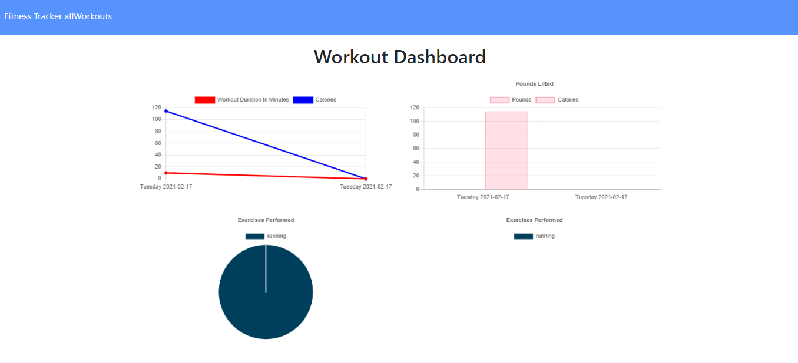

# Workout Tracker

## Task

Create a workout tracker, this assignment will require to create Mongo database with a Mongoose schema and handle routes with Express.

The application will be invoked by using the following command:

```
npm start || node server.js
```
  ## Table of Contents

  1. [User Story](#user-story)
  2. [Built With](#built-with)
  3. [How to Install](#how-to-install)
  4. [How to Use](#how-to-use)
  5. [Submission](#submission)
  6. [Index Example](#index-example)
  7. [Questions](#questions)

## User Story

```
As a user, I want to be able to view create and track daily workouts. I want to be able to log multiple exercises in a workout on a given day. I should also be able to track the name, type, weight, sets, reps, and duration of exercise. If the exercise is a cardio exercise, I should be able to track my distance traveled.
```
### Built With
----
```
  * Node.js
  * Javascript
  * Heroku
  * Node Modules
    - mongoose (database manipulation)
    - express
    - morgan
```    
### How to Install
----
```
npm i
```

### How to Use
----
```
  1- Enter the website https://workout-tracker333.herokuapp.com/.
  2- You can create new workouts, add new exercises or delete exercises to current last workout
  3- You can go and check all workouts by date and delete any exercise.
  4- You can watch the data of last 7 workouts in graphs.
```    
### Submission
---

Github Repo URL: 
[https://github.com/v1zconde/workout_tracker](https://github.com/v1zconde/workout_tracker)

Heroku Deployed URL: 
[https://workout-tracker333.herokuapp.com/](https://workout-tracker333.herokuapp.com/)

---
### Index Example


### Index Example


### Index Example


### Index Example


### Index Example



  ## Questions
you have any questions about the repo, open an issue or contact me directly at rvasquez1@gmail.com. You can find more of my work at 
  Github: [v1zconde](http://github.com/v1zconde)

